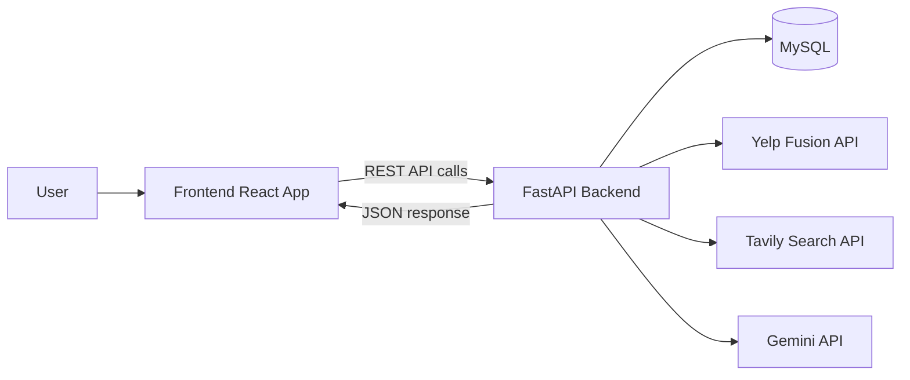
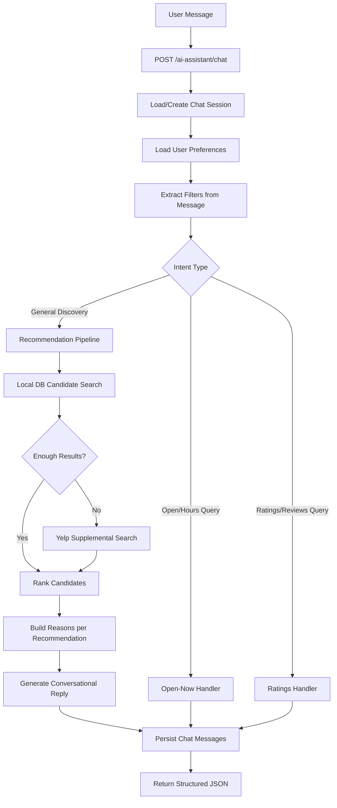

# Yelp_Demo - End-to-End Restaurant Discovery Platform

`Yelp_Demo` is a full-stack restaurant discovery app inspired by Yelp-style workflows.  
It includes search, reviews, favorites, owner tools, and a conversational AI assistant for personalized restaurant recommendations.

## Tech Stack

| Layer | Technology |
|---|---|
| Frontend | React (Vite), React Router, Tailwind CSS, Axios |
| Backend | FastAPI, SQLAlchemy, Alembic, JWT auth |
| Database | MySQL |
| AI/NLP | Gemini + LangChain output parser + deterministic heuristics |
| External APIs | Yelp Fusion API, Tavily Search API |

## Project Structure

```text
Yelp_Demo/
├── frontend/                 # React application
├── backend/                  # FastAPI application
├── docs/API.md               # Endpoint reference
└── README.md                 # This file
```

## System Architecture



## End-to-End Request Flow

### 1) User Interaction
- User opens web app and logs in.
- User searches restaurants or chats with AI assistant.

### 2) Frontend Layer
- Frontend sends API requests to backend (`VITE_API_URL`).
- Chat widget sends:
  - `message`
  - `session_id` (if existing)
  - `conversation_history`

### 3) Backend Layer
- Validates JWT and request payload.
- Loads user preferences (city, cuisines, price, dietary, ambiance).
- Extracts filters from natural language.
- Queries local MySQL data first.
- Optionally supplements results with Yelp API and Tavily context.
- Ranks candidates and generates a conversational answer.

### 4) Response Layer
- Backend returns structured JSON:
  - `reply`
  - `applied_filters`
  - `recommendations[]`
  - `session_id`
- Frontend renders chat message + recommendation cards.

## AI Assistant Architecture and Flow



## Core Features

### Diner Features
- Explore restaurants (local + Yelp supplemental).
- View details, photos, ratings, reviews.
- Write reviews and save favorites.
- Edit profile and preferences.

### Owner Features
- Owner authentication.
- Add/edit listings.
- Owner dashboard and listing activity.

### AI Assistant Features
- Multi-turn conversational chat.
- Personalized recommendations based on saved preferences.
- Reasoned recommendation cards (specific match reasons).
- Handles specialized intents:
  - open/closed queries
  - ratings/review queries
- Uses Tavily for web context when local data is limited.

## Setup and Run Locally

## Prerequisites
- Python 3.11+
- Node.js 18+
- MySQL 8+

## Backend Setup

```bash
cd backend
cp .env.example .env
python3 -m venv .venv
source .venv/bin/activate
pip install -r requirements.txt
alembic upgrade head
uvicorn app.main:app --reload --host 0.0.0.0 --port 8000
```

## Frontend Setup

```bash
cd frontend
npm install
npm run dev
```

## Deployment (Recommended)

### Frontend
- Deploy `frontend/` to **Vercel**.
- Set env var:
  - `VITE_API_URL=https://<your-backend-url>`

### Backend
- Deploy `backend/` to **Render/Railway/Fly.io**.
- Required env vars:
  - `DATABASE_URL`
  - `SECRET_KEY`
  - `CORS_ORIGINS`
- Optional (recommended):
  - `YELP_API_KEY`
  - `GEMINI_API_KEY`
  - `TAVILY_API_KEY`

## UI Screenshots

Add your UI screenshots under this section so reviewers can quickly understand the product.

### 1. Login Page
``

### 2. Signup Page
``

### 3. Home / Dashboard
``

### 4. Explore Restaurants
``

### 5. Restaurant Details
``

### 6. Write Review
``

### 7. User Profile
``

### 8. Favorites / Saved
``

### 9. AI Chatbot
``

### 10. Owner Dashboard
``

### 11. Owner My Listings
``

### 12. Owner Activity
``

## Notes
- Keep `.env` out of git (use `.env.example` only).
- Rotate API keys before public deployment.
- This project is educational and inspired by Yelp-style UX.
