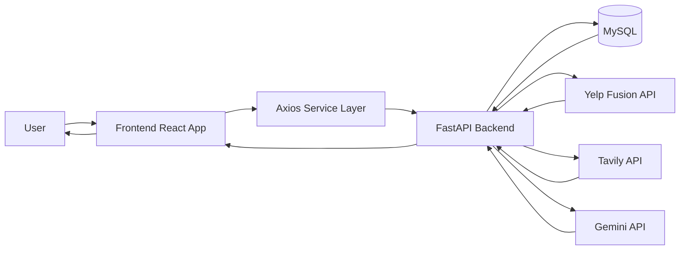
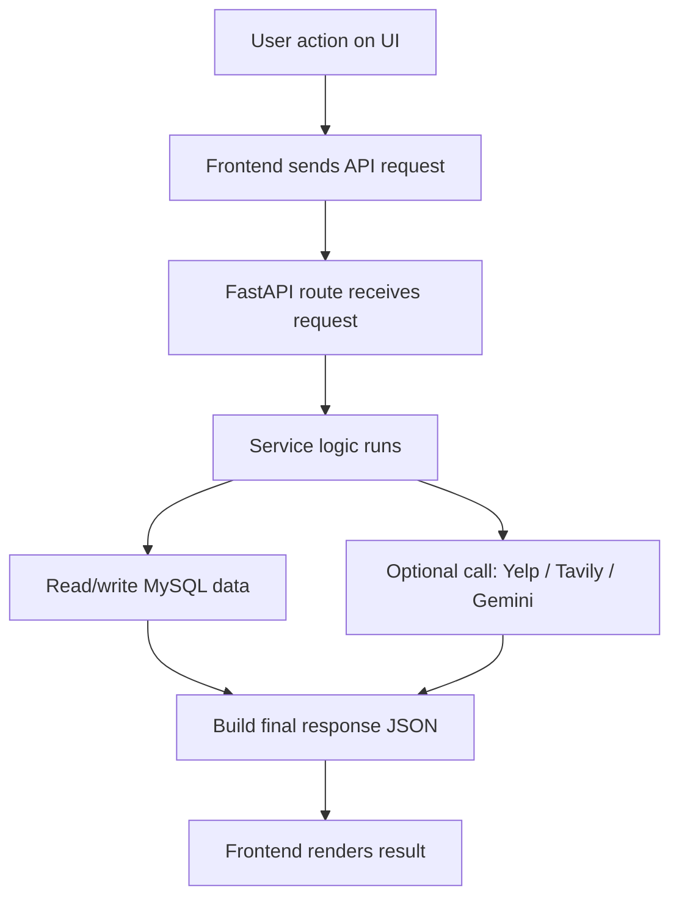
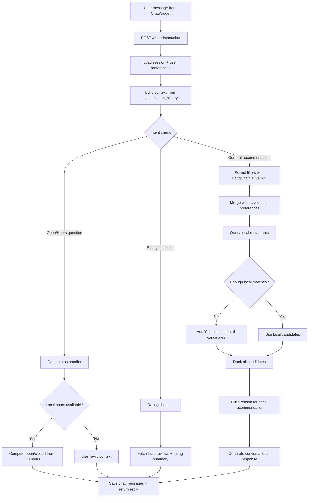

# Yelp_Demo - End-to-End Restaurant Discovery App

This is a full-stack student project inspired by Yelp-style restaurant discovery.

It supports:
- user login/signup
- explore and search restaurants
- write reviews and save favorites
- owner dashboard and listing management
- AI assistant for restaurant recommendations

---

## 1) What this project uses

| Layer | Tech |
|---|---|
| Frontend | React (Vite), React Router, Tailwind CSS, Axios |
| Backend | FastAPI, SQLAlchemy, Alembic, JWT |
| Database | MySQL |
| AI | Gemini + LangChain parser + custom ranking logic |
| External APIs | Yelp Fusion, Tavily |

---

## 2) Project folder structure

```text
Yelp_Demo/
├── frontend/         # React app
├── backend/          # FastAPI app
├── docs/API.md       # API endpoint docs
└── README.md         # This file
```

---

## 3) Whole project architecture diagram



---

## 4) End-to-end workflow (simple)



### Step-by-step in simple words
1. User clicks/searches/sends chat message in frontend.
2. Frontend calls backend API endpoint.
3. Backend validates user and reads DB data.
4. Backend may call external APIs (Yelp/Tavily/Gemini) if needed.
5. Backend returns JSON response.
6. Frontend shows cards, text, ratings, profile info, etc.

---

## 5) AI Assistant workflow diagram



### AI answer sources (important)
- **First preference:** local MySQL data
- **If needed:** Yelp supplemental data
- **For extra context:** Tavily web snippets
- **For natural language response:** Gemini

---

## 6) Main app modules

### User side
- auth (login/signup)
- restaurant explore and details
- write reviews
- favorites
- profile + preferences

### Owner side
- owner login/signup
- owner dashboard
- add/edit listings
- owner activity

### AI side
- multi-turn chat sessions
- preference-aware recommendations
- recommendation reasons on cards
- intent-specific handling (open/hours, ratings)

---

## 7) Local setup

### Backend
```bash
cd backend
cp .env.example .env
python3 -m venv .venv
source .venv/bin/activate
pip install -r requirements.txt
alembic upgrade head
uvicorn app.main:app --reload --host 0.0.0.0 --port 8000
```

### Frontend
```bash
cd frontend
npm install
npm run dev
```

---

## 8) UI screenshots section (headings)

Add your screenshots in `./screenshots/` and replace file names below.

### Login UI


### Signup UI


### Home Dashboard UI


### Explore Restaurants UI


### Restaurant Details UI


### Write Review UI


### Profile UI


### Favorites UI


### AI Assistant Chat UI


### Owner Dashboard UI


### Owner Listings UI


### Owner Activity UI


---

## 9) My Experience Building This Project

This project taught me how a complete end-to-end product works, not just one file or one page.

I learned how frontend and backend are connected in real life. In the frontend, I worked on React pages, routing, forms, and reusable components. In the backend, I worked with FastAPI routes, service logic, database models, and migrations. It helped me understand how user actions in UI become API requests, then database operations, and finally responses back to the UI.

The AI assistant part was the most challenging and most interesting. I learned how to combine user preferences, conversation history, local DB search, ranking logic, and external APIs (Gemini, Yelp, Tavily) to generate better recommendations. I also learned that good AI output depends a lot on clean data and clear logic, not only on prompts.

I also improved my debugging skills during this project. Many times, one small issue in filtering, routing, or data shape caused wrong results in chat or explore pages. Fixing those issues helped me understand full-stack flow deeply.

Overall, this project gave me strong practical experience in building, debugging, and improving a real-world data-driven web application.
