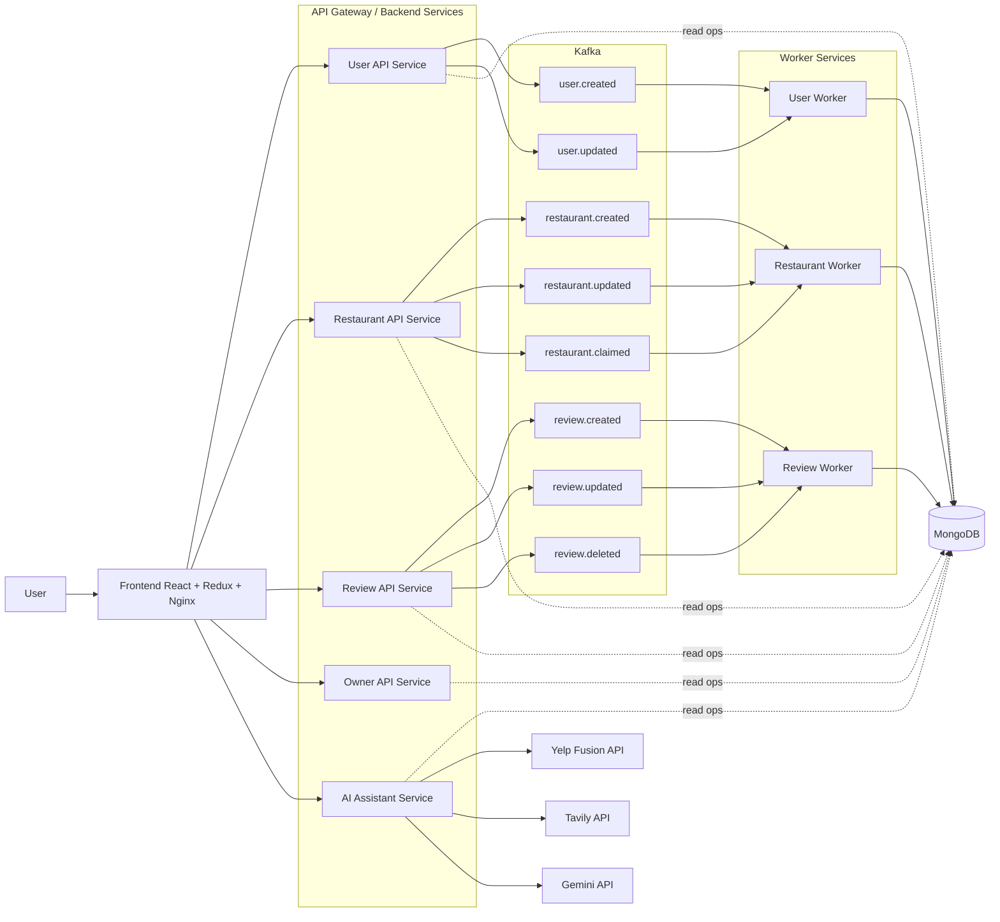
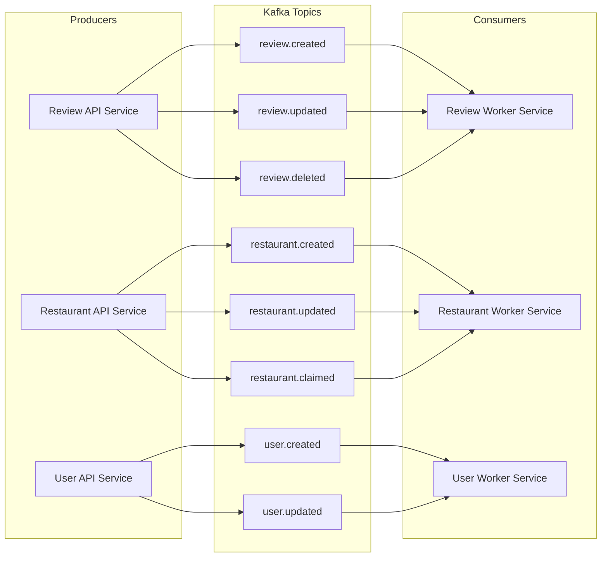
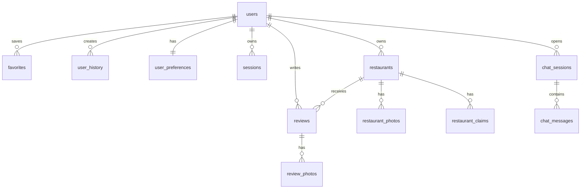
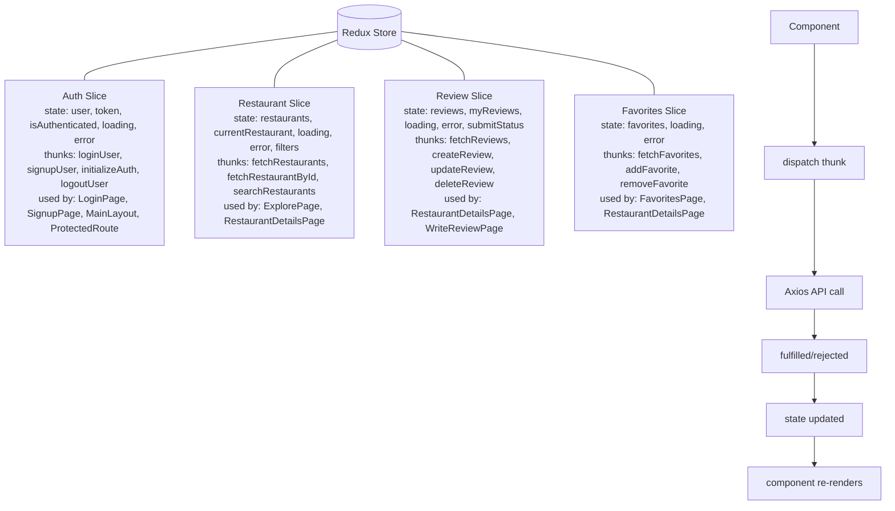
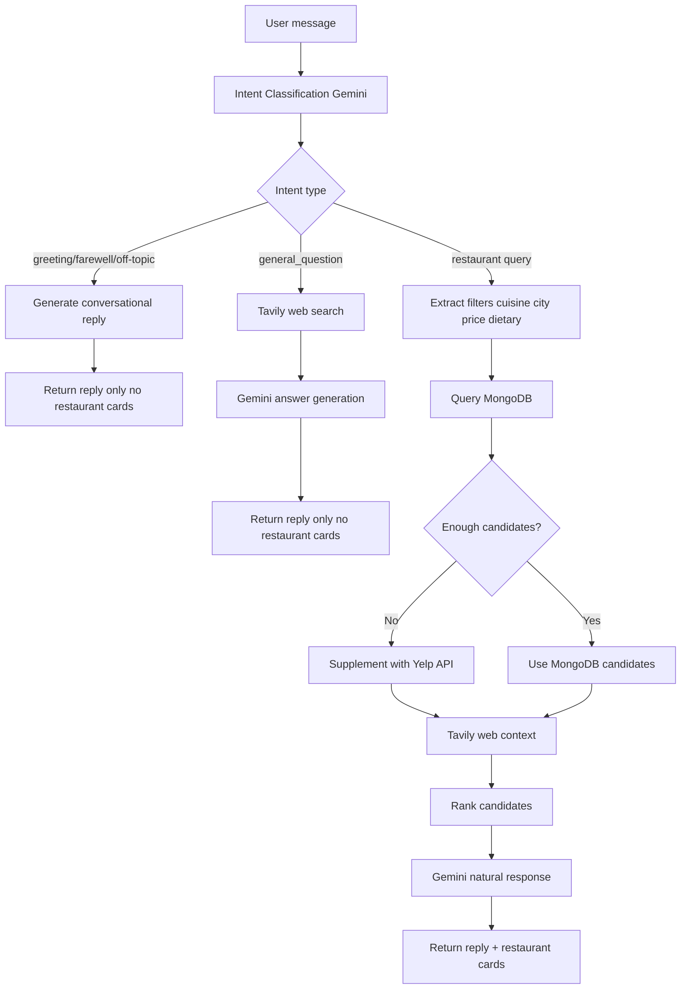
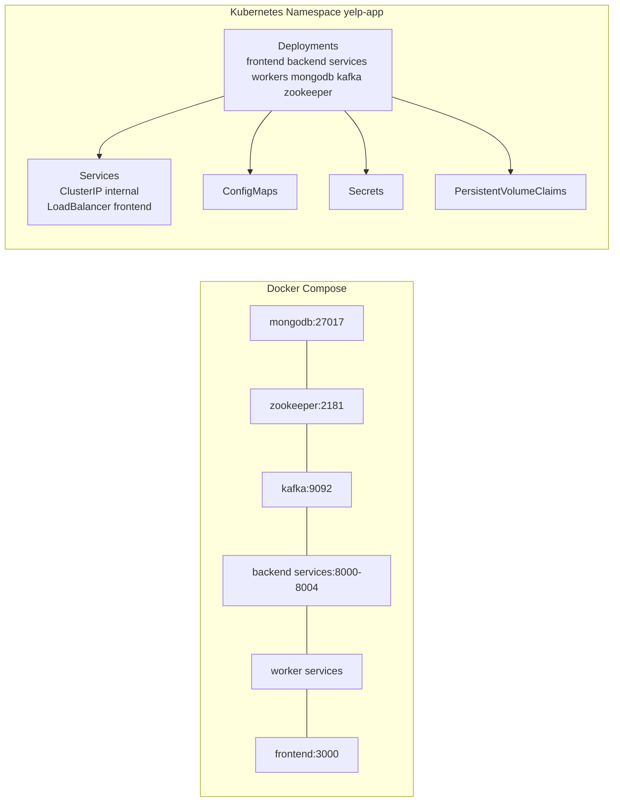
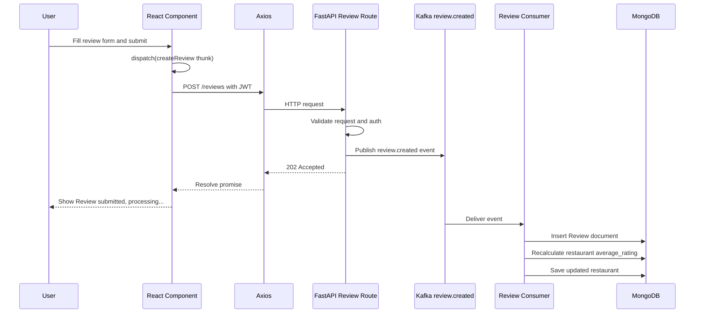

# Section 1: Project Title & Description

## Yelp Discovery App — Distributed Restaurant Discovery Platform

Yelp Discovery App is a full-stack platform for diners and restaurant owners to discover restaurants, write and manage reviews, save favorites, and get AI-assisted recommendations through a conversational interface. It is designed for users who want fast local discovery and owners who need operational visibility into listing activity. What makes this Lab 2 build special is the combination of AI-powered recommendations (Gemini + Tavily + Yelp context), event-driven write processing through Kafka, and containerized microservices deployed with Docker and Kubernetes.

---

# Section 2: Tech Stack Table

| Layer | Technology |
| --- | --- |
| Frontend | React 18, Vite, Redux Toolkit, React Router, Tailwind CSS, Axios |
| Backend | FastAPI, Beanie ODM, Motor (async MongoDB driver) |
| Database | MongoDB 7 |
| Messaging | Apache Kafka (Confluent), Zookeeper |
| AI/ML | Google Gemini, Tavily Web Search, LangChain |
| Containerization | Docker, Docker Compose |
| Orchestration | Kubernetes (AWS EKS) |
| Testing | Apache JMeter |
| Auth | JWT + bcrypt |

---

# Section 3: Project Structure

```text
Yelp_Discovery_App/
├── backend/
│   ├── Dockerfile
│   ├── app/
│   │   ├── core/
│   │   ├── db/
│   │   ├── kafka/
│   │   ├── models/
│   │   ├── routes/
│   │   ├── schemas/
│   │   ├── services/
│   │   ├── workers/
│   │   ├── main_restaurant.py
│   │   ├── main_restaurant_owner.py
│   │   ├── main_review.py
│   │   ├── main_user_reviewer.py
│   │   └── service_app_factory.py
│   ├── scripts/
│   └── services/
│       ├── restaurant/
│       ├── restaurant-owner/
│       ├── restaurant-worker/
│       ├── review/
│       ├── review-worker/
│       ├── user-reviewer/
│       └── user-worker/
├── frontend/
│   ├── Dockerfile
│   ├── nginx.conf
│   └── src/
│       ├── components/
│       ├── pages/
│       ├── services/
│       └── store/
├── k8s/
│   ├── backend/
│   ├── frontend/
│   ├── kafka/
│   ├── mongodb/
│   ├── restaurant-owner/
│   ├── restaurant-service/
│   ├── restaurant-worker/
│   ├── review-service/
│   ├── review-worker/
│   ├── user-reviewer/
│   ├── user-worker/
│   ├── zookeeper/
│   ├── namespace.yaml
│   └── deploy.sh
├── jmeter/
│   ├── yelp-load-test.jmx
│   ├── yelp-load-test-100only.jmx
│   └── README.md
├── docs/
│   ├── API.md
│   ├── ARCHITECTURE_VISUAL_GUIDE.md
│   └── kafka-architecture.mermaid
└── docker-compose.yml
```

---

# Section 4: System Architecture Diagram



---

# Section 5: Kafka Event-Driven Architecture Diagram



> All write operations are async via Kafka. Read operations query MongoDB directly.

---

# Section 6: MongoDB Schema Design



Collections and key fields:

- `users`: email, password_hash, role, display_name, phone, city, state, country, bio, avatar_url, languages, gender, is_active
- `restaurants`: name, description, city, cuisine_tags, average_rating, review_count, owner_user_id, price_level, dietary_tags, ambiance_tags, yelp_business_id
- `reviews`: user_id, restaurant_id, rating, body
- `favorites`: user_id, restaurant_id
- `user_preferences`: user_id, default_city, price_level, cuisine_tags
- `user_history`: user_id, restaurant_id, action, viewed_at
- `restaurant_photos`: restaurant_id, photo_url, sort_order
- `review_photos`: review_id, photo_url
- `restaurant_claims`: user_id, restaurant_id, status, message, admin_note, resolved_at
- `chat_sessions`: user_id, title
- `chat_messages`: chat_session_id, role, content
- `sessions`: user_id, token, expires_at

> Sessions use TTL index for auto-expiry. Passwords encrypted with bcrypt.

---

# Section 7: Redux State Management Diagram



---

# Section 8: AI Assistant Workflow Diagram



---

# Section 9: Docker & Kubernetes Deployment Diagram



---

# Section 10: End-to-End Request Flow Diagram



---

# Section 11: API Endpoints Table

| Service | Method | Endpoint | Data Path |
| --- | --- | --- | --- |
| Auth | POST | `/auth/signup` | Kafka write (`user.created`) |
| Auth | POST | `/auth/login` | Direct MongoDB |
| Auth | GET | `/auth/me` | Direct MongoDB |
| Users | GET | `/users/me` | Direct MongoDB |
| Users | PUT | `/users/me` | Kafka write (`user.updated`) |
| Users | POST | `/users/me/profile-photo` | Direct MongoDB |
| Users | GET | `/users/me/history` | Direct MongoDB |
| Restaurants | GET | `/restaurants` | Direct MongoDB |
| Restaurants | GET | `/restaurants/{id}` | Direct MongoDB |
| Restaurants | POST | `/restaurants` | Kafka write (`restaurant.created`) |
| Restaurants | PUT | `/restaurants/{id}` | Kafka write (`restaurant.updated`) |
| Restaurants | GET | `/restaurants/yelp` | Yelp proxy (read) |
| Restaurants | GET | `/restaurants/yelp/{yelpId}` | Yelp proxy (read) |
| Reviews | GET | `/restaurants/{id}/reviews` | Direct MongoDB |
| Reviews | POST | `/reviews` | Kafka write (`review.created`) |
| Reviews | PUT | `/reviews/{id}` | Kafka write (`review.updated`) |
| Reviews | DELETE | `/reviews/{id}` | Kafka write (`review.deleted`) |
| Favorites | GET | `/favorites/me` | Direct MongoDB |
| Favorites | POST | `/favorites/{id}` | Direct MongoDB |
| Favorites | DELETE | `/favorites/{id}` | Direct MongoDB |
| Owner | GET | `/owner/dashboard` | Direct MongoDB |
| Owner | GET | `/owner/restaurants` | Direct MongoDB |
| Owner | GET | `/owner/reviews` | Direct MongoDB |
| Owner | POST | `/restaurants/{id}/claim` | Kafka write (`restaurant.claimed`) |
| AI | POST | `/ai-assistant/chat` | Direct MongoDB + AI providers |
| AI | GET | `/ai-assistant/sessions` | Direct MongoDB |
| AI | GET | `/ai-assistant/sessions/{id}` | Direct MongoDB |
| AI | DELETE | `/ai-assistant/sessions/{id}` | Direct MongoDB |
| Uploads | POST | `/uploads/restaurant-photo` | Direct storage + MongoDB refs |
| Uploads | POST | `/uploads/profile-photo` | Direct storage + MongoDB refs |
| Health | GET | `/health` | Direct service health |

---

# Section 12: JMeter Performance Testing

We load tested critical APIs using Apache JMeter: authentication (`POST /auth/login`), restaurant retrieval (`GET /restaurants`), and review submission (`POST /reviews`) through the Kafka async flow. Tests were executed at concurrency levels 100, 200, 300, 400, and 500 users. Metrics collected include average response time, throughput (requests/second), and error rate (%). This provides clear visibility into system behavior as load increases and where bottlenecks begin (CPU, MongoDB reads, consumer lag, etc.).


```bash
jmeter -n -t jmeter/yelp-load-test.jmx -l results.csv -e -o report/
```

---

# Section 13: Local Setup Instructions

```bash
git clone <repo>
cd Yelp_Discovery_App
cp .env.example .env  # fill in API keys
docker-compose up --build
# Frontend: http://localhost:3000
# Backend: http://localhost:8000
# MongoDB: localhost:27017
```

Manual setup (without Docker):

Backend:

```bash
cd backend
python3 -m venv .venv
source .venv/bin/activate
pip install -r requirements.txt
uvicorn app.main_user_reviewer:app --reload --port 8001
```

Frontend:

```bash
cd frontend
npm install
npm run dev
```

---

# Section 14: Kubernetes Deployment Instructions

```bash
cd k8s
kubectl apply -f namespace.yaml
kubectl apply -f mongodb/
kubectl apply -f zookeeper/
kubectl apply -f kafka/
kubectl apply -f backend/
kubectl apply -f frontend/
kubectl get pods -n yelp-app
```

---

# Section 15: Keep existing UI Screenshots section (Section 8 from old README) as-is

## 9) UI screenshots section (headings)

Add your screenshots in `./screenshots/` and replace file names below.

### Login UI


### Signup UI


### Home Dashboard UI


### Explore Restaurants UI


### Restaurant Details UI


### Write Review UI


### Profile UI


### Favorites UI


### AI Assistant Chat UI


### Owner Dashboard UI


### Owner Listings UI


### Owner Activity UI


---

# Section 16: Keep existing Work Distribution section (Section 10 from old README) as-is

## 10) Work Distribution

This lab was completed by Manav and Ritika.

- Manav: Frontend and Backend
- Ritika: Backend and AI Integration

---

# Section 17: Experience section — update to mention Lab 2 learnings: Docker, Kubernetes, Kafka, MongoDB migration, Redux, distributed systems concepts.

Lab 2 gave us practical experience in building and operating a real distributed system instead of only writing app logic. We learned how Docker standardizes environments across machines, and how Kubernetes on AWS EKS handles service deployment, networking, and runtime orchestration. Kafka taught us how event-driven write workflows decouple APIs from heavy processing and improve responsiveness under load. Migrating from MySQL to MongoDB helped us model flexible restaurant and user data more naturally, while Redux made frontend state transitions predictable and easier to debug. Overall, this lab connected core distributed systems concepts (asynchronous messaging, service separation, scalability, and resilience) to hands-on implementation.
